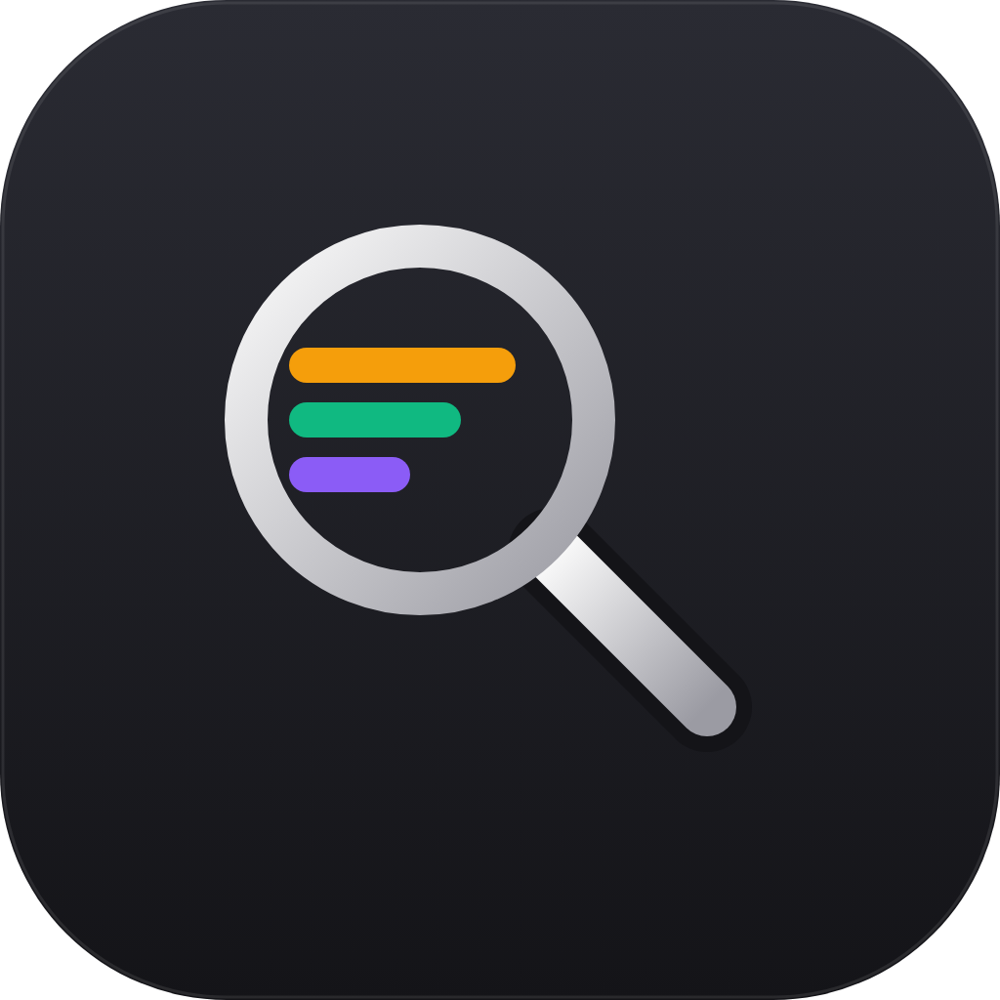
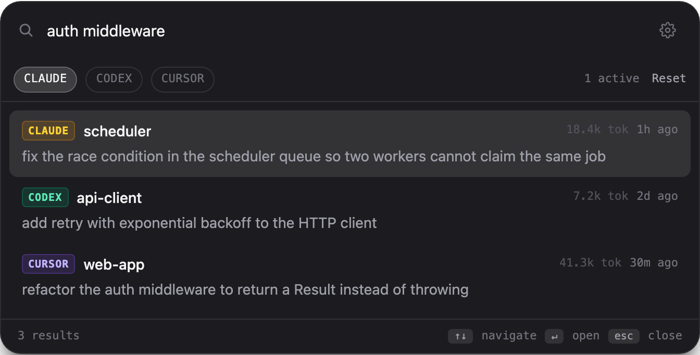

<p align="center">
  
</p>

<h1 align="center">AI Session Finder</h1>

<p align="center">
  <a href="./LICENSE"></a>
  <a href="https://github.com/marcelomoresco/ai-session-finder/actions/workflows/ci.yml"></a>
  <a href="https://github.com/marcelomoresco/ai-session-finder/releases"></a>
</p>

> **Status: 🚧 Work in progress.** Building in the open, sprint by sprint.

A fast, open-source macOS launcher for searching across your **Claude Code**, **Codex CLI**, and **Cursor** sessions — one keystroke to find that conversation you half-remember.

<p align="center">
  
</p>

## Why

Your AI coding history is scattered across tools, each with its own log format. AI Session Finder indexes them locally and gives you a single Spotlight-style search over everything: full-text and semantic, fully on-device.

## Install

> macOS 12+ (Apple Silicon or Intel). The MVP ships **unsigned** — see the Gatekeeper note below.

**Homebrew (recommended):**

```bash
brew install --cask marcelomoresco/tap/ai-session-finder
```

**Or grab the DMG** from [Releases](https://github.com/marcelomoresco/ai-session-finder/releases), open it, and drag the app into Applications.

Because the app isn't signed with an Apple Developer ID yet, the **first launch** needs **Right-click → Open** → **Open** (Homebrew installs clear the quarantine flag for you). Then press **⌘E** anywhere to search (rebindable in Settings).

## Features

- 🔍 One search box over **Claude Code**, **Codex CLI**, and **Cursor** sessions
- ⚡ Full-text (FTS5) **and** semantic search — all on-device, zero telemetry
- ⌘+Shift+Space global launcher, menu-bar tray, frameless preview
- ↩️ Resume any session in its original tool
- 🔁 Auto-update from GitHub Releases (asks before installing)

## Stack

- **Electron** + **TypeScript** (strict) + **React 19**
- **SQLite** via `better-sqlite3` (FTS5 + `sqlite-vec` for vector search)
- **Transformers.js** for local embeddings (no data leaves your machine)
- **tRPC** for IPC, **Vitest** for tests
- **pnpm** workspaces, **ESLint** + **Prettier**

## Project layout

```
apps/
  main/        Electron main process (electron-vite)
  renderer/    React UI (Tailwind 4 + shadcn/ui)
  indexer/     indexing worker thread        (Sprint 03)
packages/
  domain/      pure types + domain logic     (Sprint 01)
  contracts/   tRPC/Zod IPC schemas          (Sprint 04)
```

## Quick start

Requires **Node 20+** and **pnpm 10+** (`npm i -g pnpm`).

```bash
pnpm install     # install workspace deps
pnpm dev         # launch Electron in dev mode (HMR)
pnpm test        # run the test suite
pnpm lint        # ESLint
pnpm typecheck   # TypeScript across all workspaces
pnpm build       # production bundles
```

## Roadmap

Development is organized into eight sprints (00 → 07). The plans live in
[`.claude/sprints/`](./.claude/sprints/ROADMAP.md) — start with the
[roadmap](./.claude/sprints/ROADMAP.md).

| Sprint | Theme                | Status         |
| ------ | -------------------- | -------------- |
| 00     | Foundation (setup)   | ✅ done        |
| 01     | Domain & Persistence | ✅ done        |
| 02     | Source Adapters      | ✅ done        |
| 03     | Indexer Pipeline     | ✅ done        |
| 04     | Services & IPC       | ✅ done        |
| 05     | UI Launcher          | ✅ done        |
| 06     | macOS Integration    | ✅ done        |
| 07     | Release              | 🟢 in progress |

## Contributing

Contributions are welcome — see [CONTRIBUTING.md](./CONTRIBUTING.md) and our
[Code of Conduct](./CODE_OF_CONDUCT.md). To report a security issue, see
[SECURITY.md](./SECURITY.md).

## License

[Apache License 2.0](./LICENSE) © AI Session Finder contributors
